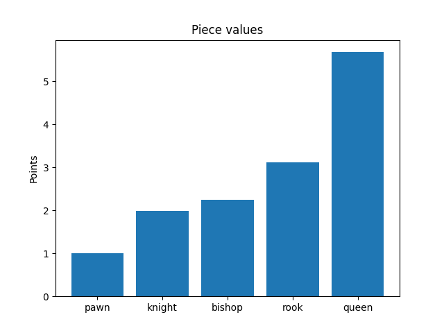

# Motivations

I've been taught that the pieces in chess have the following values:
- pawns: 1
- knights: 3
- bishops: 3
- rooks: 5
- queens: 9

This is only meant to be a good heuristic. But can I arrive at an analytic value for each piece?

In this naive approach, I assume that only the relative amounts of each piece contributes to the likelihood of a player winning/losing. Only games that ended in a checkmate are included in this analysis.

# Results

